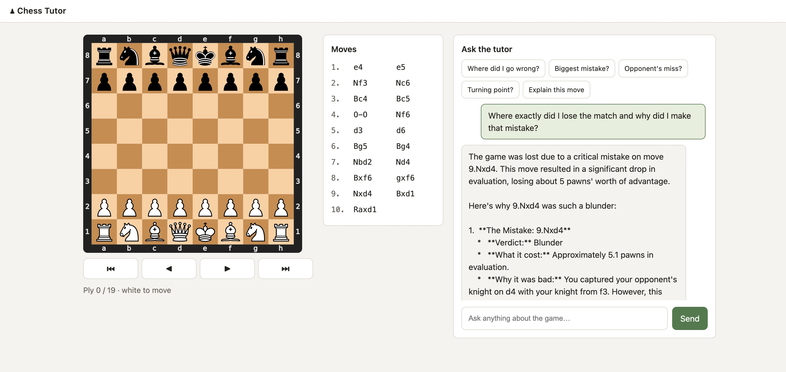

# Conversational AI Chess Tutor

Review a chess game and ask why a move worked, where things went wrong, or what you could have played instead. Use the local browser app or the terminal interface to explore your PGN with Stockfish analysis and Gemini explanations.

The project separates chess analysis from conversation: **Stockfish evaluates positions, python-chess validates moves, and Gemini explains the returned facts.** Hypothetical lines run on copies of the board, preserving the original game.



*Review a game with move navigation and conversational feedback in the local web app.*

## Features

- **Interactive game review:** load a PGN export or the included sample game, choose your side, and navigate the moves.
- **Explanations tied to analysis:** inspect engine evaluations, candidate moves, tactical motifs, and positional features.
- **Player-aware feedback:** ask about your mistakes, your opponent's missed opportunities, or the game's turning points.
- **What-if exploration:** compare alternative moves and explore variations without changing the original game.
- **Two interfaces:** a browser board with move navigation and chat, plus an interactive CLI.
- **Visible tool calls:** the server or terminal prints `[engine tool]` logs when the tutor consults the analysis tools.

## Quick start

### 1. Install prerequisites

You need Python **3.10 or newer**, Git, and a Stockfish executable. No Node.js, npm, or frontend build step is required.

On macOS with Homebrew:

```bash
brew install stockfish
```

On other platforms, install Stockfish with your package manager or use a binary from the [Stockfish downloads page](https://stockfishchess.org/download/). If it is not on your `PATH`, set `STOCKFISH_PATH` to the executable's absolute path.

### 2. Clone and install Python dependencies

```bash
git clone https://github.com/SahirHuq/chess-tutor.git
cd chess-tutor
python3 -m venv .venv
.venv/bin/python -m pip install -r requirements.txt
```

The commands here use macOS/Linux paths. On Windows, use `.venv\Scripts\python.exe` in place of `.venv/bin/python`.

### 3. Configure your Gemini key

Create an API key in [Google AI Studio](https://aistudio.google.com/), then copy the configuration template:

```bash
cp .env.example .env
```

Edit `.env` locally and enter your key as the value of `GEMINI_API_KEY`. The file is ignored by Git. Load its values into your shell before starting either interface (bash/zsh):

```bash
set -a
source .env
set +a
```

**The application reads environment variables; it does not load `.env` automatically.** You can also configure the variables directly in your shell or process manager.

### 4. Start the browser app

```bash
.venv/bin/python web_app.py
```

Open [http://127.0.0.1:8000](http://127.0.0.1:8000), paste a PGN or choose **Load sample game**, and select White or Black. Click a move or use the navigation controls and arrow keys, then ask a question in chat.

Without a Gemini key or Stockfish, the browser app still supports loading games and navigating the board. Chat requires both.

## Terminal interface

```bash
# Choose a pasted game, file, or the sample interactively
.venv/bin/python tutor.py

# Review a PGN file and identify your side
.venv/bin/python tutor.py mygame.pgn --color white

# Read a PGN from standard input
.venv/bin/python tutor.py - --color black < mygame.pgn
```

In interactive paste mode, finish the PGN with a line containing only `END`. Choosing your side lets the tutor distinguish your moves from your opponent's; it does not infer your side from the result.

Try asking:

- “What was my biggest mistake?”
- “What did my opponent miss?”
- “Explain this position and suggest a plan.”
- “What if I had castled instead?”
- With the sample game: “Why is 9.Nxd4 a blunder?”

## Configuration

| Variable | Purpose | Default |
| --- | --- | --- |
| `GEMINI_API_KEY` | Gemini credential, required for chat | Unset |
| `STOCKFISH_PATH` | Absolute path to the Stockfish executable | Search `PATH` |
| `CHESS_WEB_HOST` | Web server bind address | `127.0.0.1` |
| `CHESS_WEB_PORT` | Web server port | `8000` |

The model is set to `gemini-2.5-flash-lite` in `tutor.py`. Engine defaults in `engine.py` are depth 18, three candidate lines, and up to eight half-moves displayed per principal variation. Whole-game reviews can take longer because they evaluate multiple positions.

## How it works

```text
Browser / terminal
        |
        v
GeminiTutor: conversation and tool requests
        |
        v
Tool layer: navigation, analysis, move comparisons, explanations
        |
        +--> SessionState: original game and copied what-if branches
        +--> python-chess: legality, board state, position facts
        +--> Stockfish: evaluations and candidate lines
```

The manual model loop executes tool calls, returns their results to Gemini, retries transient server errors, and logs engine consultations. The prompt instructs the model to ground concrete chess claims in those results. This reduces unsupported claims, but it is not a guarantee that every generated explanation is correct.

Engine evaluations use **White's point of view**: positive favours White, negative favours Black. Move comparisons account for the mover's colour.

| Path | Responsibility |
| --- | --- |
| `engine.py` | Stockfish lifecycle, scores, and principal variations |
| `session.py` | PGN state, player identity, navigation, and variations |
| `features.py` | Material, pawn structure, mobility, king safety, and positional changes |
| `tactics.py` | Forks, pins, and newly hanging pieces |
| `tools.py` | Grounded analysis and navigation tools exposed to the model |
| `tutor.py` | Gemini adapter, prompting, and terminal interface |
| `web_app.py` | Local HTTP server and shared review-session bridge |
| `web/` | Vanilla HTML, CSS, and JavaScript interface |
| `test_*.py` | Logic, state, engine integration, prompt, and web-app tests |
| `sample.pgn` | Example game with a tactical mistake |
| `architecture_explainer.html` | Standalone architecture walkthrough |
| `chess-system-flow.excalidraw` / `.png` | Editable architecture diagram and image |

## Development and tests

```bash
.venv/bin/python -m pytest -q
```

The suite covers board facts, positional changes, tactics, safe branching, player-aware move reviews, and the web application. Engine integration tests require Stockfish on `PATH` and skip when it is unavailable. Tests do not require a live Gemini API key.

There is currently no project-configured linter or static type checker.

## Secrets, data, and limitations

- Keep real keys in your local environment or ignored `.env` file. Commit only the blank `.env.example`; never put a key in frontend JavaScript, a PGN, or documentation.
- The Gemini client uses the key on the Python server. Browser state reports only whether a key is present.
- Chat sends conversation context, game information, and analysis results to Google's Gemini API. Stockfish analysis runs locally.
- The web server is intended for **one local user**. It has shared in-memory state and no authentication; keep the default localhost binding.
- Gemini availability, quotas, and charges depend on your account and the selected model. A usable API key does not guarantee unlimited requests.
- Tactical and positional features are heuristics. Forced-mate comparisons can produce very large raw centipawn-loss values; use the verdict and mate information to interpret them.
- Sessions are held in memory and are not saved across restarts.

## Troubleshooting

| Symptom | What to check |
| --- | --- |
| `GEMINI_API_KEY is not set` | Load `.env` into the same shell used to launch the app, then restart it. |
| Stockfish not found | Install Stockfish and check `PATH`, or set `STOCKFISH_PATH`. |
| Port 8000 is already in use | Set `CHESS_WEB_PORT` to an available port and restart. |
| Gemini rate-limit error | Wait before retrying and check your account's quota. |
| PGN fails to load | Use a valid PGN export with legal moves; try `sample.pgn` to verify setup. |
